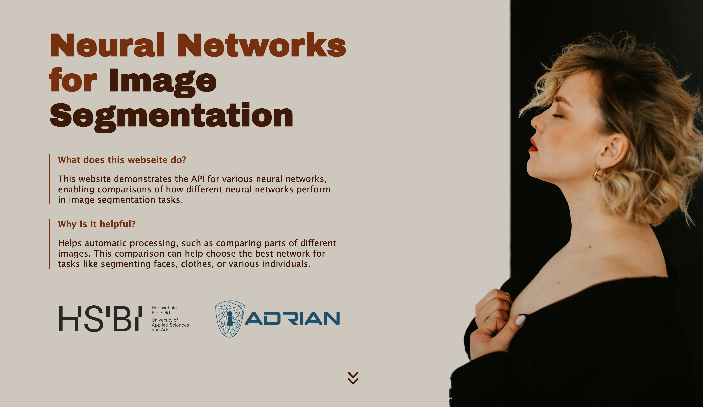
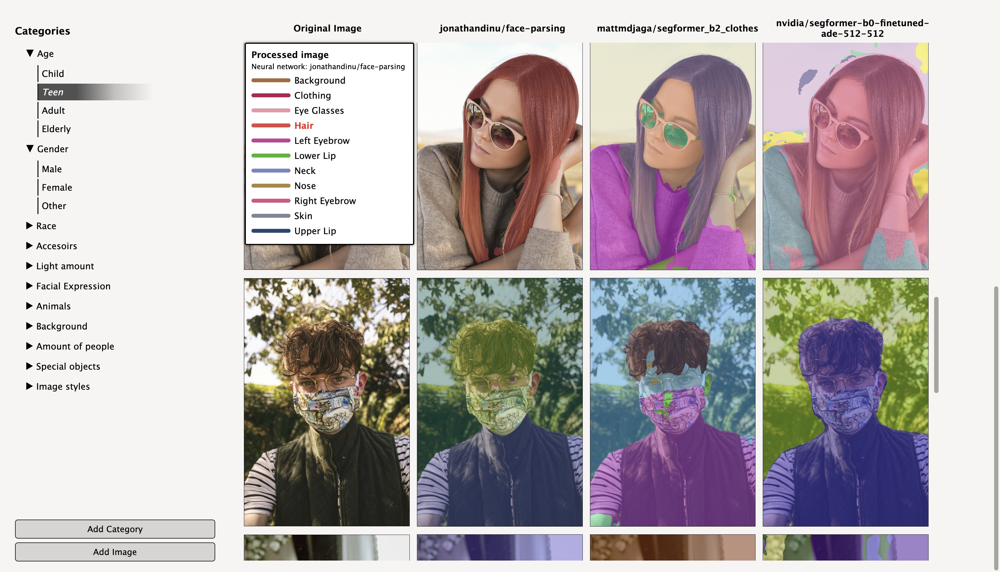

<h1>Neural Networks for Image Segmentation</h1>

A web application for comparing various AI models for image segmentation to help select the most suitable model for specific purposes.

 
<h2>Overview</h2>

This platform enables users to compare different AI models for image segmentation, facilitating the selection of the most appropriate model based on specific requirements. One of the primary use cases is the comparison between two images to determine whether they depict the same person, a critical functionality for projects like <a href="https://www.hsbi.de/wirtschaft/forschung/arbeitsgruppe-angewandte-ki/adrian">ADRIAN</a>.

 
<h2>Demo and screenshots:</h2>

 

 

  
<h2>Features</h2>
<ul>
<li><b>Model Comparison:</b> Compare multiple AI models side by side to evaluate their performance on image segmentation tasks. Models which were used are:
<ul>
<li><b>jonathandinu/face-parsing</b> - https://huggingface.co/jonathandinu/face-parsing</li>
<li><b>mattmdjaga/segformer_b2_clothes</b> - https://huggingface.co/mattmdjaga/segformer_b2_clothes</li>
<li><b>nvidia/segformer-b0-finetuned-ade-512-512</b> - https://huggingface.co/nvidia/segformer-b0-finetuned-ade-512-512</li>
<li> ... and more models are coming up soon!</li>
</ul>
</li>
<li><b>Image Management:</b> Upload, edit, and manage images with associated categories for organized storage and retrieval.</li>
<li><b>Interactive Interface:</b> Visualize segmented images with overlay animations and detailed descriptions for better understanding and analysis.</li>
<li><b>Extensible Architecture:</b> Designed to easily incorporate additional AI models, allowing for continuous expansion and updates.</li>
</ul>

 
<h2>Features in development</h2>
<ul>
<li>Adding origin, tags and notes. Currently saved only as placeholders in the "Add image" popup, but soon will be updated.</li>
<li>User messages notifying that the image or category was saved/removed/... successfully</li>
<li>... write your ideas in the issues!</li>
</ul>

 
<h2>Architecture</h2>
<ul>
<li><b>Frontend: Angular</b> – Provides a dynamic and responsive user interface.</li>
<li><b>Backend: Node.js with Express.js </b> – Handles API requests, business logic, and serves the frontend.</li>
<li><b>AI Processing: Python</b> – Executes AI models for image segmentation and processing tasks.</li>
<li><b>Database: SQLite</b> – Manages application data, including images, categories, and user information.</li>
</ul>
You can find a sceme for the architecture under <a href='./docu/Architecture.pdf'>docu/Architecture.pdf</a>.

 
<h2>Getting Started</h2>

To get started with the project, please refer to the <a href='./docu/GETTING_STARTED.md'>GETTING_STARTED</a> guide, which provides detailed instructions on setting up the development environment, installing dependencies, and running the application locally.

 
<h2>More documentation</h2>

There is a folder docu in this repository, which includes some documentation, to be specific:
- docu 
  - <a href='./docu/images'>images</a> (images for this readme and other files)
  - <a href='./docu/GETTING_STARTED.md'>GETTING_STARTED.md</a> (a very important guide on how to start the website locally)
  - <a href='./docu/ADDING_NEURAL_NETWORK.md'>ADDING_NEURAL_NETWORK</a> (a guide on how to add a new neural network from the 'achitectural' point of view, read it before working on the new neural network)
  - <a href='./docu/ADDING_NEW_POPUP.md'>ADDING_NEW_POPUP.md</a> (a guide on how to add a popup to be consistent with existing frontend architecture)
  - <a href='-/docu/Architecture.pdf'>Architecture.pdf</a> (the architecture of the website depicted in a sceme)

 
<h2>Contributing</h2>

Contributions are welcome! Please follow these steps to contribute:
<ol>
<li>Fork the Repository</li>
<li>Create a New Branch: <code>git checkout -b feature/YourFeatureName
</code></li>
<li>Make and commit your changes</li>
<li>Push to the branch: <code>git push origin feature/YourFeatureName</code></li>
<li>Open a Pull Request</li>
</ol>